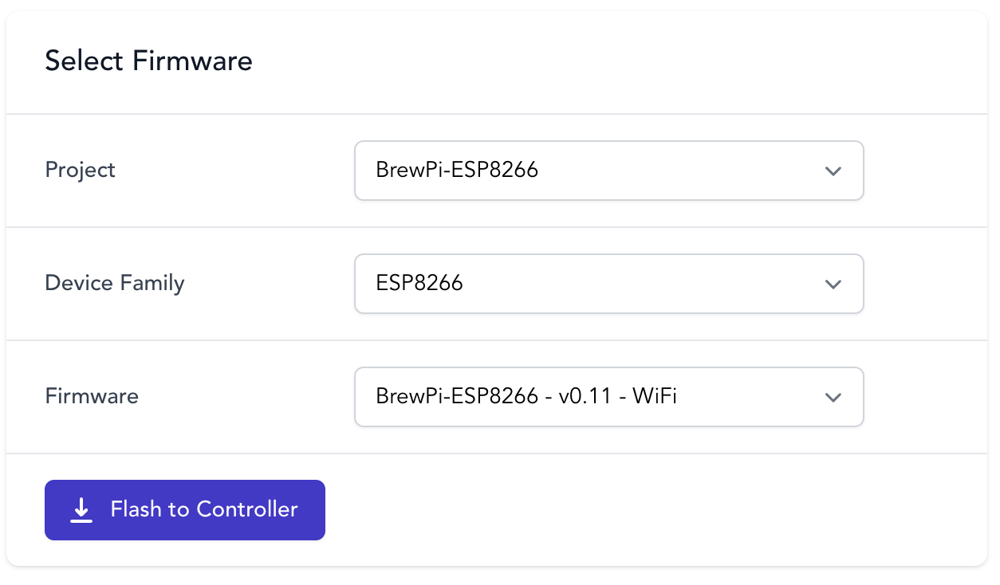

# BrewFlasher Web Edition


A web-based tool for flashing brewing-related firmware to your ESP8266 or ESP32.




## About
BrewFlasher Web Edition is a web-based tool that allows the user to flash specific firmware (upload software) to an
ESP32 or ESP8266. It will automatically locate the firmware on the internet, download it, and flash it to your chip with
minimal input required. Simple, fast, and magic.

This project was built as a web-based alternative to [BrewFlasher](http://www.brewflasher.com/). Both clients share an
underlying firmware list and are 

This project was built as a natural complement to a handful of other projects I either support or collaborate on, where
a user is expected to flash firmware to an ESP8266 or ESP32 controller. For many users, this step of the installation
process is the most daunting - either because it requires the use of third-party tools that aren't mentioned in the
project they want to use, requires the use of the command line, or - oftentimes - isn't explained at all. BrewFlasher
simplifies this process, handling most of the required steps automatically.

**Note** - BrewFlasher Web Edition can be launched by navigating to [https://web.brewflasher.com/](https://web.brewflasher.com/) - this 
repo should only be used by  developers interested in extending the app's features or integrating it into their own projects.

## Requirements

BrewFlasher Web Edition requires [Web Serial support](https://caniuse.com/web-serial) in your browser, and is therefore
limited to the current, desktop versions of the following browsers:

- Microsoft Edge
- Google Chrome
- Opera

If you do not use one of the above browsers, I recommend downloading the [desktop version of BrewFlasher](http://www.brewflasher.com/) instead.


## Using BrewFlasher Web Edition

BrewFlasher Web Edition is available for use at: [https://web.brewflasher.com/](https://web.brewflasher.com/)

Downloading this repo is not recommended/required unless you are intending to help develop the app.


## Supported Firmware
BrewFlasher is designed to specifically support a handful of beer- and brewing-related projects for the ESP32 or
ESP8266. Those projects include:

- BrewPi-ESP8266
- TiltBridge
- BrewBubbles
- Keg Cop
- Flite
- iSpindHub
- SBL4TILT
- GravityMon

An up-to-date list of supported firmware can be found at the [BrewFlasher](https://www.brewflasher.com/about/supported_projects/) website.

If you have a beer- or brewing-related project you would like supported, raise 
an [issue on the Desktop BrewFlasher repo](https://github.com/thorrak/brewflasher/issues) and we can discuss it.

If you are looking to flash generic firmware, I recommend the [NodeMCU PyFlasher](https://github.com/marcelstoer/nodemcu-pyflasher) 
desktop tool that BrewFlasher was based on.


## Developer Notes

BrewFlasher Web Edition is a Vue3-based web app. It uses [esp-web-tools](https://esphome.github.io/esp-web-tools/) to 
handle firmware flashing and uses a list of firmware/firmware manifests hosted at [BrewFlasher.com](http://www.brewflasher.com/).

The app can be installed locally for development using NPM:

##### Project setup
```
npm install
```

#### Compiles and hot-reloads for development
```
npm run serve
```

#### Compiles and minifies for production
```
npm run build
```
